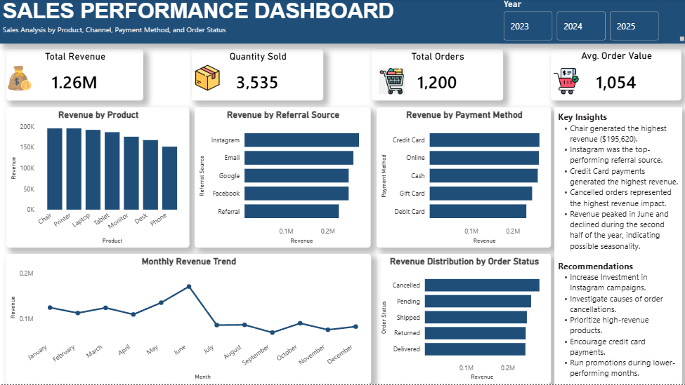

# Project 4: Sales Performance Dashboard

## Overview

This project focuses on building an interactive Power BI dashboard to analyze sales performance across products, referral sources, payment methods, and order status.

## Tools Used
- Power BI
- DAX

## Data Source
- Sales dataset (Excel file)

## Key Tasks Performed
- Built an interactive sales performance dashboard in Power BI.
-Created DAX measures for Total Orders and Average Order Value.
- Created calculated columns to support analysis.
- Designed KPI cards and interactive visualizations.
- Analyzed sales performance by Product, Referral Source, Payment Method, Order Status, and Month.
- Generated business insights and recommendations from the data.

## Key Metrics

- Total Revenue: 1.26M
- Quantity Sold: 3,535
- Total Orders: 1,200
- Average Order Value: 1,054

## Dashboard Insights

- Chairs generated the highest revenue.
- Instagram was the top-performing referral source.
- Credit Card payments generated the highest revenue.
- Cancelled orders represented the highest revenue impact.
- Revenue peaked in June before declining in the second half of the year.

## Recommendations

- Increase investment in Instagram campaigns.
- Investigate causes of order cancellations.
- Prioritize high-revenue products.
- Encourage credit card payments.
- Run promotions during lower-performing months.

## Dashboard Preview

